# 芯片

https://www.arterytek.com/cn/product/AT32F403A.jsp

原项目使用了AT32F403ACGU7和AT32F435CGU7，后者性能更高。

除此之外也可以选用相近的AT32F403ACxxx和AT32F435Cxxx，但要保证flash大于512KB。

为了1:1复原，暂时选择AT32F403ACGU7，和硬件原理图保持一致。


# 屏幕

[中景园 ST7789 IPS 1.54inch屏幕](https://item.taobao.com/item.htm?id=600467790218&ali_refid=a3_430673_1006:1151926661:N:RJwpqEZSBeef9oplU%2FG0erdQXHNUIGLMbjxUjePoUps%3D:c5e666e29cd76924d1848b0193797d52&ali_trackid=1_c5e666e29cd76924d1848b0193797d52&spm=a2e0b.20350158.31919782.1)

ST7789 IPS 1.54inch屏幕  SPI接口 240x240分辨率 60Hz刷新率  

ST7789指的是驱动芯片，需要使用配套的驱动程序，原项目使用的是Adafruit公司的驱动程序。

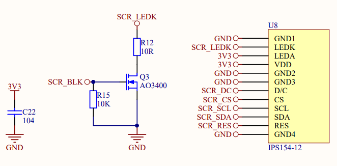

根据原理图可以看到主控芯片以及裸屏的引脚连接情况。最后选择黄保凯中景园1.54寸240*240高清ips显示屏st7789驱动高清液晶屏。

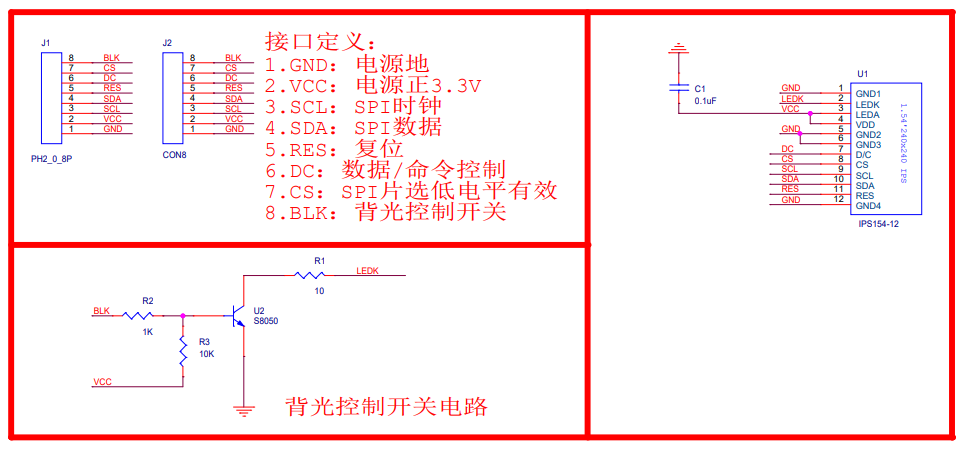

IO接口（HAL_Config.h），SPI协议，同时代码使用了DMA通道（HAL_Display.cpp）。

| 名称    | Pin              | 功能            |
| ------- | ---------------- | --------------- |
| SCR_DC  | PA4              | 数据/命令控制   |
| SCR_CS  | PB0              | 片选低电平有效  |
| SCR_SCL | PA5（SPI1_CLK）  | SPI时钟信号输入 |
| SCR_SDA | PA7（SPI1_MISO） | SPI数据输入     |
| SCR_RES | PA6              | 复位            |
| SCR_BLK | PB1              | 背光控制开关    |

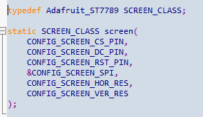

# IMU

[加速度计 LSM6DSM](https://item.taobao.com/item.htm?spm=a230r.1.14.1.5111601fNoKlFT&id=681603401815&ns=1&abbucket=1#detail)

https://blog.csdn.net/su_fei_ma_su/article/details/125947605

IMU：三轴加速度计+三轴陀螺仪。之所以将两者组合在一个模块里，是为了让这两个传感器的三轴重合。陀螺仪反应相对于body系的各轴瞬时角速度，通过积分+初始姿态可以得到世界坐标系下的姿态角；加速度计反应各轴承受的加速度情况，假设Z轴垂直向上，那么只有Z轴有重力加速度，其他轴通过二次积分可以反应水平位移；如果Z轴不垂直向上，那么重力加速度会叠加到其他两轴，根据不同轴的分力，可以得到世界坐标系下的姿态角。

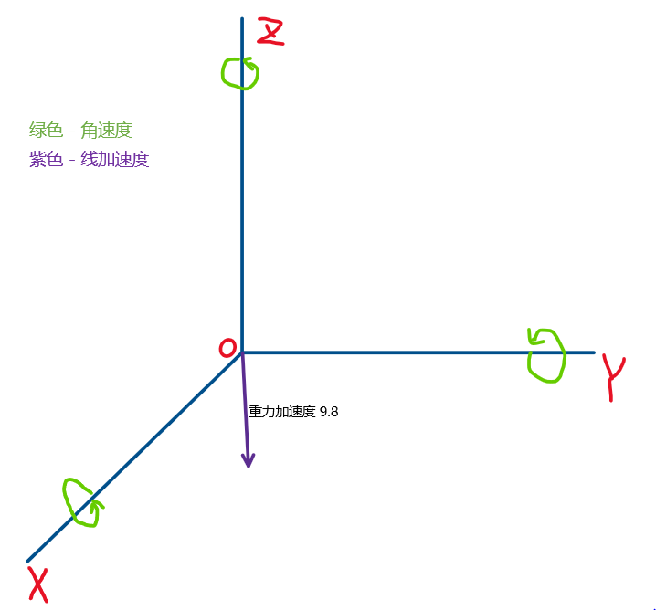

陀螺仪现实中积分其实就只是将每次采样值累加，并假定采样间隔期间是匀速运动，但误差会随着时间累计。

零飘：静止情况下，角速度不是0，而是在某个值附近上下乱跳；去除零飘的方法是在上电后采集一段时间数据求取标准差，并将之后的测量值减去这个标准差。

温漂：长时间动动加上采样均速假设导致的误差。

加速度计误差：高频噪声，单独使用效果差；轴间误差，各轴不严格垂直；尺度误差，加速度测量精度问题；

陀螺仪可以积分得出姿态角度，加速度计可以通过3轴关系得到姿态角度。陀螺仪获得姿态角，短时间准确，长时间会漂移。加速度计获得姿态角，短时间震荡严重，长时间相对准确。那么把这两个传感器数据做融合，取长补短，就可以获得相对准确的姿态角：

目前项目用的是 Mahony 算法（自适应互补滤波器），我也用EKF融合试了下，效果都非常不错

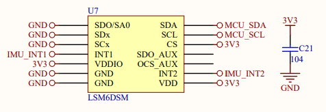

| 名称     | Pin  | 功能 |
| -------- | ---- | ---- |
| MCU_SCL  | PB6  |      |
| MCU_SDA  | PB7  |      |
| IMU_INT1 | PB10 |      |
| IMU_INT2 | PB11 |      |

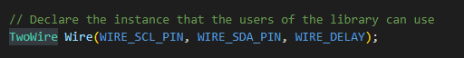

TwoWire封装了I2C基本功能，在LSM6DSM中使用。

中断接口暂时不清楚哪里用到了。

# 磁力计

[地磁计 LIS3MDL](https://item.taobao.com/item.htm?spm=a230r.1.14.1.313a4d8fZxrJbg&id=671364707030&ns=1&abbucket=1#detail)

三轴磁力计：采用三个互相垂直的磁阻传感器，每个轴向上的传感器检测在该方向上的地磁场强度，因此磁力计可以测得在世界坐标系下的yaw、roll、pitch。

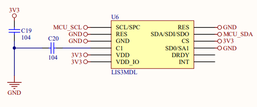

| 名称    | Pin  | 功能 |
| ------- | ---- | ---- |
| MCU_SCL | PB6  |      |
| MCU_SDA | PB7  |      |

磁力计和IMU使用同样I2C引脚。

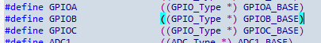

GPIO本质是操作寄存器。

```
GPIOB = GPIOB_BASE = APB2PERIPH_BASE + 0x0C00 = (PERIPH_BASE + 0x10000) + 0x0C00 = 0x40010c00
```


# GPS

[ATGM336H-5N系列模块](https://www.icofchina.com/pro/mokuai/2016-08-01/4.html)

[中科微HT1818Z3G5L GPS芯片](https://item.taobao.com/item.htm?spm=a230r.1.14.27.22387a54XGjRUT&id=669752725912&ns=1&abbucket=4#detail)

实际使用的是HT1818Z3G5L(AT6558)，使用串口2通信。

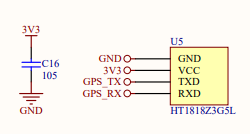

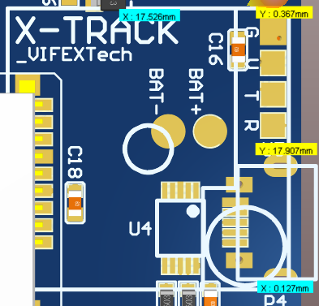

| 名称   | Pin  | 功能 |
| ------ | ---- | ---- |
| GPS_TX | PA3  |      |
| GPS_RX | PA2  |      |


# 拨盘编码器

[MITSUMI美上美拨轮编码器](https://item.taobao.com/item.htm?spm=a230r.1.14.1.2fb54f9eec557f&id=596202182869&ns=1&abbucket=4#detail)

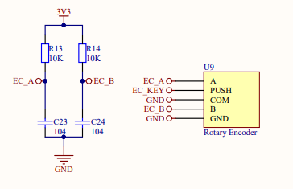

| 名称   | Pin  | 功能 |
| ------ | ---- | ---- |
| EC_A   | PB5  |      |
| EC_B   | PB4  |      |
| EC_KEY | PB3  |      |


# SD卡座

[自弹式TF卡座](https://detail.tmall.com/item.htm?ali_refid=a3_430582_1006:1104520036:N:iHEpUPPUKN1OQUgmeL6hRicPE%20jb6TeW:705b802e5b23b0509e3d23057cf767c7&ali_trackid=1_705b802e5b23b0509e3d23057cf767c7&id=20693027604&spm=a230r.1.14.1&skuId=3807453352314)

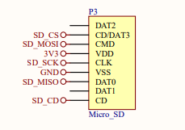

使用SPI2通信。

| 名称    | Pin  | 功能                 |
| ------- | ---- | -------------------- |
| SD_CD   | PA8  | 卡插入检测           |
| SD_MOSI | PB15 | 主设备输出从设备输入 |
| SD_MISO | PB14 | 主设备输入从设备输出 |
| SD_SCK  | PB13 | 时钟                 |
| SD_CS   | PB12 | SPI设备主从片选      |